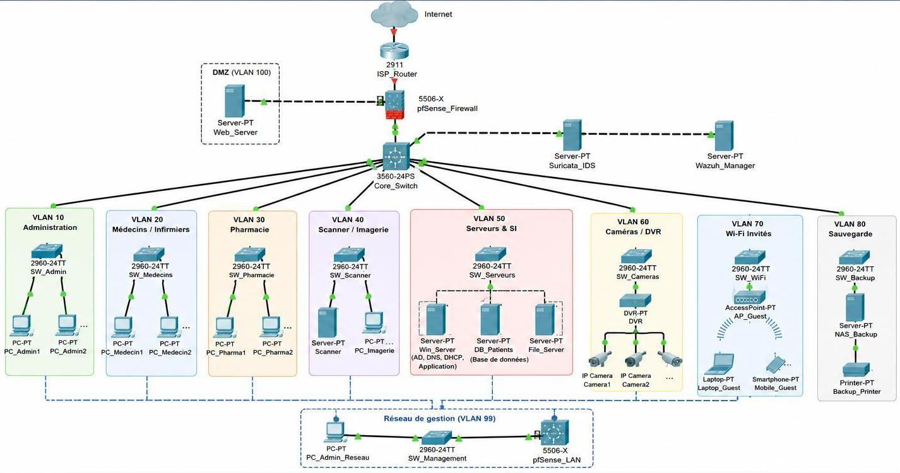
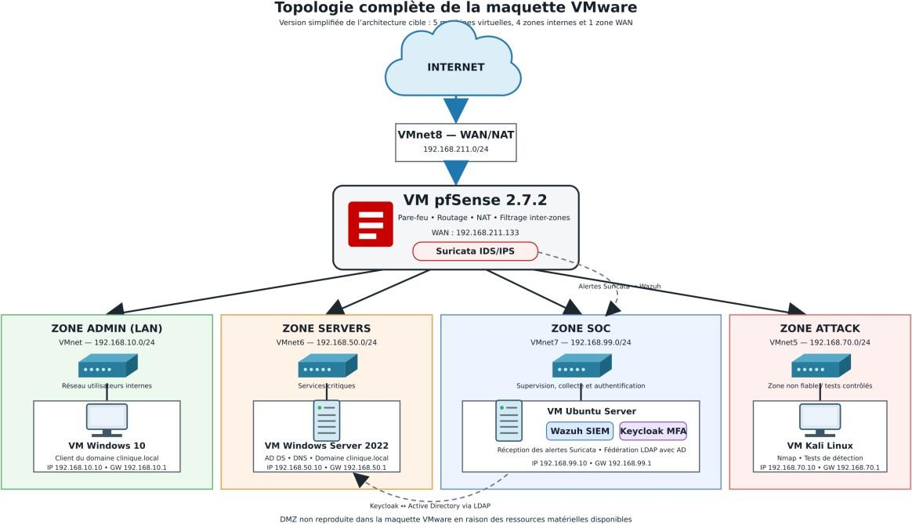
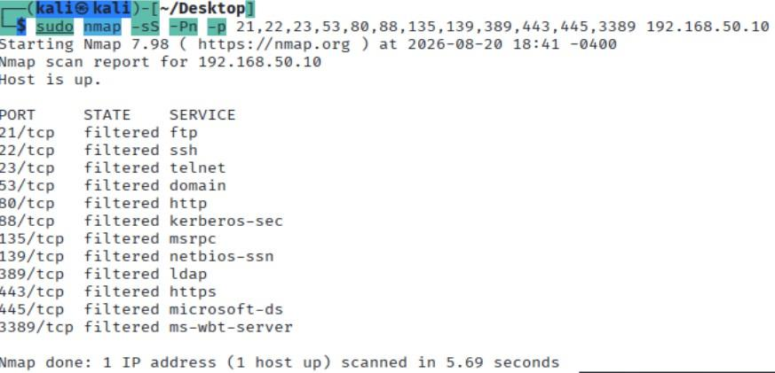
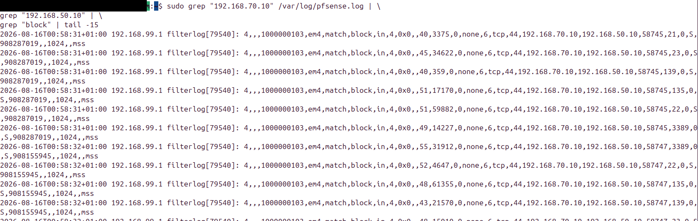
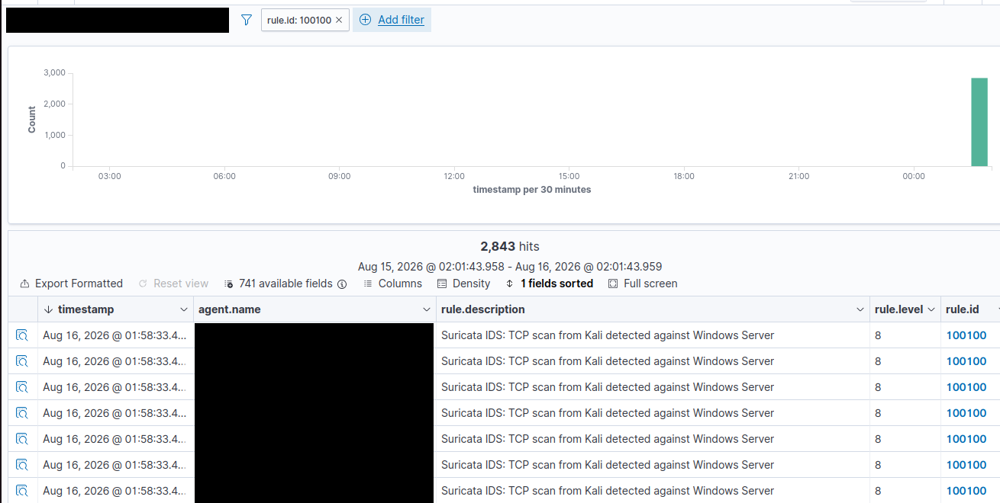

# Zero Trust Clinic Lab

**Laboratoire d'une architecture réseau sécurisée pour un établissement de santé : segmentation pfSense, supervision Wazuh, détection Suricata, annuaire Active Directory et MFA Keycloak, le tout dérivé d'une analyse de risques EBIOS Risk Manager.**

🇬🇧 [English version](README.en.md)



## Contexte et objectif
Les établissements de santé sont des cibles privilégiées (rançongiciels, vol de données médicales). Ce projet, réalisé lors d'un stage de perfectionnement (EMSI Tanger, 4IIR Réseaux & Cybersécurité), part d'un audit d'un réseau quasi plat pour aboutir à une **architecture cible segmentée**, dont les principaux mécanismes sont **validés dans une maquette VMware isolée**.

Le cas d'étude est **anonymisé** : aucune donnée réelle du client, aucun identifiant ni configuration de production dans ce dépôt.

## Mon rôle
- Analyse des résultats d'un scan Nmap et cartographie de l'existant
- Analyse de risques **EBIOS Risk Manager** (5 ateliers) : actifs, sources de risque, 5 scénarios, plan de traitement P1/P2/P3
- Conception de l'architecture cible (9 VLAN + DMZ), plan d'adressage et matrice des flux
- Construction de la maquette VMware (5 VM, 4 zones + WAN)
- Configuration de **pfSense** (interfaces, NAT, règles inter-zones)
- Déploiement d'**Active Directory / DNS** (`clinique.local`) et jonction d'un poste Windows 10
- Déploiement de **Wazuh** (manager + agent Windows) et de l'**intégration Suricata → Wazuh**
- Déploiement de **Suricata** en mode IDS sur la zone non fiable
- **Keycloak** fédéré à Active Directory (LDAP) avec second facteur TOTP
- Tests de validation et documentation

## Architecture de la maquette

| Zone | Sous-réseau | Rôle | VM |
|---|---|---|---|
| WAN | 192.168.211.0/24 | Accès Internet (NAT) | pfSense |
| ADMIN (LAN) | 192.168.10.0/24 | Utilisateurs internes | Windows 10 |
| SERVERS | 192.168.50.0/24 | Serveurs critiques | Windows Server 2022 (AD DS, DNS) |
| SOC | 192.168.99.0/24 | Supervision et authentification | Ubuntu (Wazuh, Keycloak) |
| ATTACK | 192.168.70.0/24 | Zone non fiable, tests contrôlés | Kali Linux |



Les 9 VLAN de l'architecture cible sont regroupés en 4 zones dans la maquette, faute de ressources matérielles. Détails dans [`architecture/`](architecture/).

## Démarche de sécurité (EBIOS RM)

| Scénario | Risque | Mesures mises en œuvre dans la maquette |
|---|---|---|
| SO1 | Rançongiciel via un poste exposé | Segmentation pfSense, supervision Wazuh, détection Suricata, MFA |
| SO2 | Exfiltration interne de données | Contrôle d'accès AD, moindre privilège, Wazuh, MFA |
| SO3 | Compromission via un prestataire | Comptes temporaires, règles pfSense, MFA, supervision |
| SO4 | Intrusion via DVR / Wi-Fi | Zone isolée, règles pfSense, Suricata |
| SO5 | Fuite via imprimantes | Réseau isolé, filtrage pfSense |

Les mesures organisationnelles (sauvegarde 3-2-1, filtrage e-mail, blocage USB, politique d'accès tiers) sont des **recommandations** du plan de traitement, non déployées dans la maquette.

## Démonstration : de l'attaque à l'alerte

Un scan contrôlé est lancé depuis Kali (zone ATTACK) vers le serveur Windows (zone SERVERS).

**1. pfSense bloque** : tous les ports apparaissent `filtered`.



**2. Les logs pfSense confirment le blocage** (ATTACK em4 → SERVERS).



**3. Suricata détecte, Wazuh centralise** : règle personnalisée 100100, niveau 8.



## Résultats

| Test | Résultat |
|---|---|
| Segmentation inter-zones | Flux autorisés fonctionnels, ATTACK isolée |
| Scan ATTACK → SERVERS | Ports `filtered`, blocage visible dans les logs |
| Domaine `clinique.local` + DNS | Poste Windows 10 joint, connexion avec compte du domaine |
| Wazuh | Agent actif, échecs d'authentification détectés (règle 60122) |
| Suricata → Wazuh | Scan TCP détecté, alerte centralisée (règle 100100) |
| Keycloak + AD | Connexion avec mot de passe + code TOTP |

Toutes les captures : [`screenshots/`](screenshots/).

## Technologies
pfSense 2.7.2 · Suricata · Wazuh · Active Directory / DNS (Windows Server 2022) · Keycloak · Kali Linux · Nmap · VMware Workstation

## Structure du dépôt
```
architecture/       schémas et plan d'adressage
pfsense/            interfaces et matrice des règles
suricata/           règle locale
wazuh/              règle personnalisée, extrait de configuration
keycloak/           procédure LDAP + MFA
active-directory/   scripts PowerShell de référence
screenshots/        captures de validation
docs/               documentation
```

## Limites et pistes d'amélioration
- Maquette virtuelle à effectifs réduits ; DMZ et équipements réels (imprimantes, DVR) non reproduits.
- **Durcissement des règles par ports** : la règle LAN → SERVERS est encore large ; une version limitée à DNS/Kerberos/LDAP/SMB est proposée dans [`pfsense/`](pfsense/) et reste à valider par test.
- Keycloak en labo : la production nécessite HTTPS, certificat valide et intégration des applications (OpenID Connect / SAML).
- Suricata est en mode IDS (sans blocage automatique) ; passage en IPS à évaluer.
- Résultats à confirmer par une phase de recette avant tout usage réel.

## Avertissement
Dépôt pédagogique. Les tests offensifs ont été menés uniquement dans un laboratoire isolé. Ne pas réutiliser ces configurations telles quelles en production.

## Auteure
Najoua Ezzarouali, élève ingénieure (4IIR Réseaux & Cybersécurité), EMSI Tanger.
